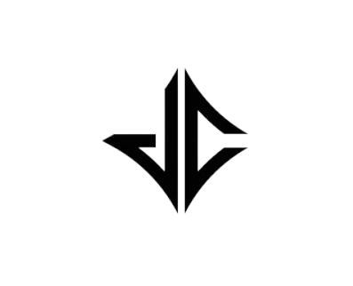

<a name="readme-top">

<br/>

<br />
<div align="center">
  <a href="https://github.com/xjancarlo">
  <!-- TODO: If you want to add logo or banner you can add it here -->
    
  </a>
<!-- TODO: Change Title to the name of the title of your Project -->
  <h3 align="center">Headers & Footers</h3>
</div>
<!-- TODO: Make a short description -->
<div align="center">
 This project is an interactive website dedicated to showcasing creative and functional header and footer designs for websites.
</div>

<br />

<!-- TODO: Change the zyx-0314 into your github username  -->
<!-- TODO: Change the WD-Template-Project into the same name of your folder -->


---

<br />
<br />

<!-- TODO: If you want to add more layers for your readme -->
<details>
  <summary>Table of Contents</summary>
  <ol>
    <li>
      <a href="#overview">Overview</a>
      <ol>
        <li>
          <a href="#key-components">Key Components</a>
        </li>
        <li>
          <a href="#technology">Technology</a>
        </li>
      </ol>
    </li>
    <li>
      <a href="#rule,-practices-and-principles">Rules, Practices and Principles</a>
    </li>
    <li>
      <a href="#resources">Resources</a>
    </li>
  </ol>
</details>

---

## Overview

<!-- TODO: To be changed -->
<!-- The following are just sample -->
### Header and Footer Gallery Project

The Header and Footer Gallery project is a showcase of diverse header and footer designs, demonstrating the versatility and creativity in web design. This project features a gallery page displaying 10 unique header styles and 10 distinct footer styles, split evenly between static and animated designs. Each design is crafted using pure HTML and CSS, highlighting various techniques and aesthetic choices. Visitors can navigate through the gallery to explore the different styles, with each entry providing a visual feast and inspiration for web developers and designers. The project is structured with a clean and organized file system and includes a landing page with a welcoming title, subtitle, and navigation buttons to ensure an engaging and user-friendly experience.

Guiding Question:

- What is the project?

The Header and Footer Gallery project is a web-based showcase designed to display a variety of header and footer styles. It aims to present both static and animated designs, offering a comprehensive look at different web design approaches and techniques.

- What's the purpose?

The purpose of this project is to provide inspiration and practical examples for web designers and developers. By showcasing multiple header and footer styles, the project demonstrates the potential of HTML and CSS in creating visually appealing and functional web components.

- What are the key components?

Landing Page: Includes a title, subtitle, description, and navigation buttons to guide users.
Header Gallery: Displays 5 different static header styles and 5 animated header styles.
Footer Gallery: Features 5 different static footer styles and 5 animated footer styles.
Interactive Navigation: Allows users to easily browse through the various designs.

### Key Components
<!-- TODO: List of Key Components -->
<!-- The following are just sample -->
- 5 Static Header
- 5 Animated Header
- 5 Static Footer
- 5 Animated Footer

### Technology
<!-- TODO: List of Technology Used -->


## Rules, Practices and Principles
1. Always use `WD-` in the front of the Title of the Project for the Subject followed by your custom naming.
2. Do not rename any .html files; always use `index.html` as the filename.
3. Place Files in their respective folders.
4. All file naming are in camel case.
   - Camel case is naming format where there is no white space in separation of each words, the first word is in all lower case while the succeding words first letter are in upper followed by lower cased letters.
   - ex.: buttonAnimatedStyle.css
5. Use only `External CSS`.
6. Renaming of Pages folder names are a must, and relates to what it is doing or data it holding.
7. File Structure to follow below.

```
WD-ProjectName
└─ assets
|   └─ css
|   |   └─ style.css
|   └─ img
|   |   └─ fileWith.jpeg/.jpg/.webp/.png
|   └─ js
|       └─ script.js
└─ pages
|  └─ pageName
|     └─ assets
|     |  └─ css
|     |  |  └─ style.css
|     |  └─ img
|     |  |  └─ fileWith.jpeg/.jpg/.webp/.png
|     |  └─ js
|     |     └─ script.js
|     └─ index.html
└─ index.html
└─ readme.md
```
